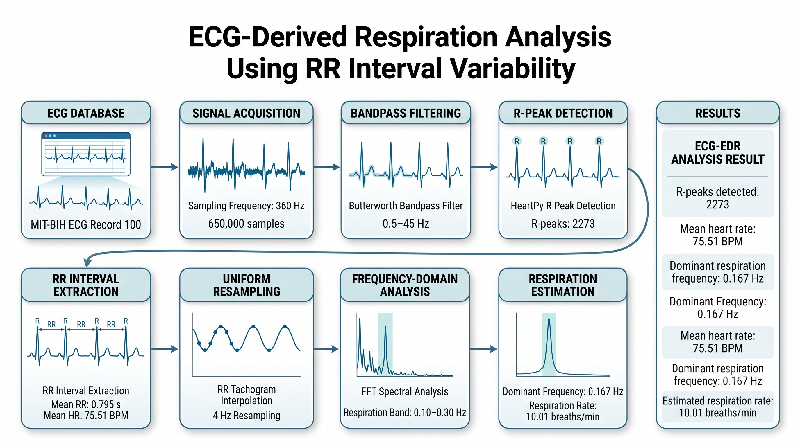
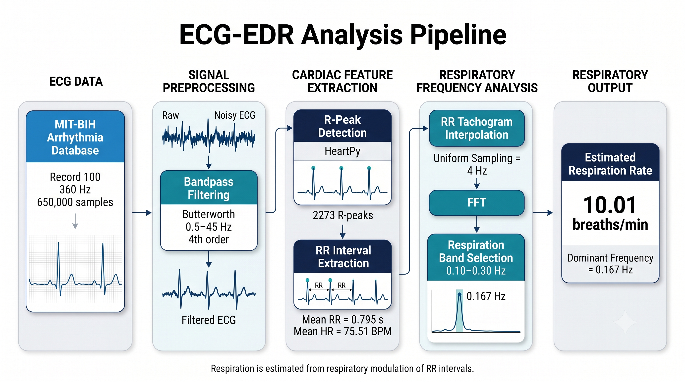
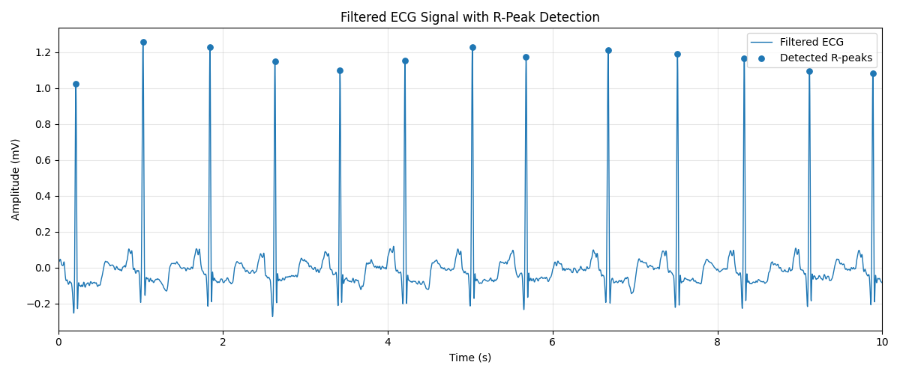
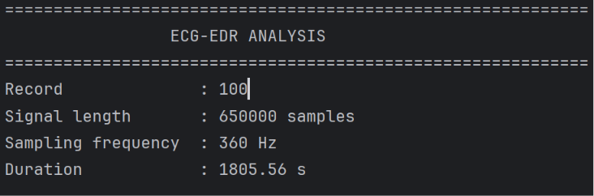
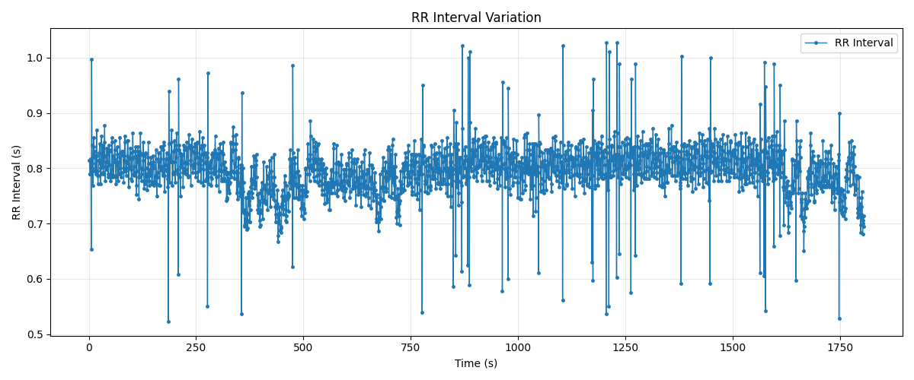
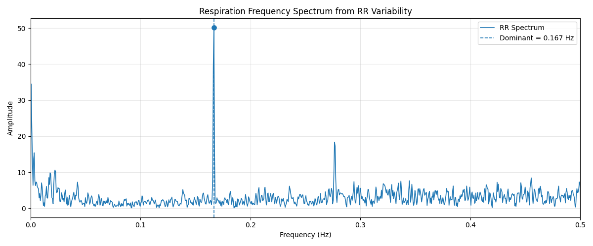
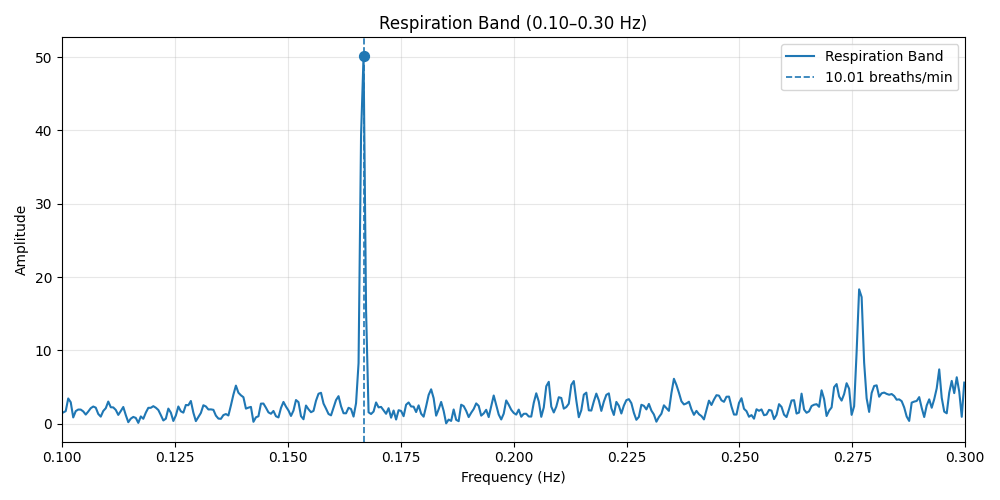
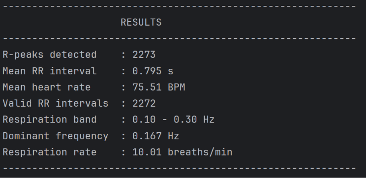

# ECG-Based Respiration Estimation

A Python-based biomedical signal processing project for estimating respiratory rate from ECG signals using **RR interval variability** and frequency-domain analysis.



## Overview

Respiration influences heart-rate variability through respiratory sinus arrhythmia. This project uses an ECG record from the **MIT-BIH Arrhythmia Database (Record 100)**, processes the ECG signal, detects R-peaks, extracts RR intervals, converts the irregularly sampled RR series into a uniformly sampled tachogram, and estimates the dominant respiratory frequency using FFT-based spectral analysis.

The current implementation focuses on **ECG-based respiration estimation from RR interval variability**.

## Objectives

- Load and process an ECG signal from a WFDB record.
- Remove unwanted frequency components using bandpass filtering.
- Detect cardiac R-peaks.
- Calculate RR intervals and mean heart rate.
- Convert irregular RR intervals to a uniformly sampled signal.
- Analyze RR variability in the frequency domain.
- Identify the dominant frequency within the respiration band.
- Estimate respiratory rate in breaths per minute.
- Visualize each major stage of the analysis.

## System Architecture



The processing pipeline consists of:

```text
MIT-BIH ECG Record 100
          │
          ▼
    ECG Signal Input
          │
          ▼
  Butterworth Bandpass
      0.5–45 Hz
          │
          ▼
   R-Peak Detection
          │
          ▼
   RR Interval Series
          │
          ▼
  Uniform Resampling
        4 Hz
          │
          ▼
    FFT Analysis
          │
          ▼
 Respiration Band Selection
       0.10–0.30 Hz
          │
          ▼
 Dominant Respiration
     Frequency
          │
          ▼
 Respiratory Rate
   breaths/min
```

## Methodology

### 1. ECG Signal Acquisition

The project uses **Record 100** from the MIT-BIH Arrhythmia Database.

| Parameter | Value |
|---|---:|
| Record | 100 |
| Sampling frequency | 360 Hz |
| Signal length | 650,000 samples |
| Duration | ~1805.56 s |

The ECG signal is loaded using the `wfdb` Python package.

### 2. Bandpass Filtering

A fourth-order Butterworth bandpass filter is applied to the ECG signal.

**Passband:** 0.5–45 Hz

This preprocessing stage produces the filtered ECG used for subsequent R-peak detection.



### 3. R-Peak Detection

R-peaks are detected from the filtered ECG using **HeartPy**.

The detected R-peak locations are converted from sample indices into time values. The interval between successive R-peaks is then calculated.



### 4. RR Interval Extraction

The RR interval is the time difference between consecutive R-peaks.

The resulting RR interval series is used to characterize heart-rate variation.



### 5. Uniform RR Resampling

RR intervals occur at non-uniform time points because heartbeats are not perfectly periodic. For FFT-based frequency analysis, the RR interval series is interpolated onto a uniformly sampled time grid.

**Resampling frequency:** 4 Hz


### 6. Frequency-Domain Analysis

The uniformly sampled RR signal is detrended and transformed into the frequency domain using the Fast Fourier Transform (FFT).

The analysis focuses on the selected respiration frequency band:

**0.10–0.30 Hz**

The frequency with the highest spectral magnitude within this band is selected as the dominant respiration frequency.



### 7. Respiratory Rate Estimation

The dominant respiration frequency is converted to breaths per minute:

```text
Respiratory Rate = Dominant Frequency × 60
```

For the current analysis:

```text
Dominant Frequency = 0.167 Hz

Respiratory Rate ≈ 0.167 × 60
                  ≈ 10.01 breaths/min
```



## Results

The current analysis of MIT-BIH Record 100 produced:

| Metric | Result |
|---|---:|
| R-peaks detected | 2273 |
| Mean RR interval | 0.795 s |
| Mean heart rate | 75.51 BPM |
| Valid RR intervals | 2272 |
| Respiration frequency band | 0.10–0.30 Hz |
| Dominant respiration frequency | 0.167 Hz |
| Estimated respiration rate | 10.01 breaths/min |



These values represent the output of the implemented processing pipeline for the selected ECG record.

## Technologies Used

- **Python**
- **WFDB** — ECG record loading
- **NumPy** — numerical computation
- **Matplotlib** — signal visualization
- **HeartPy** — R-peak detection and ECG processing
- **SciPy** — filtering, interpolation, and FFT-based analysis

## Project Structure

```text
ECG-Based-Respiration-Estimation/
│
├── 100.dat
├── 100.hea
├── Main.py
├── README.md
├── requirements.txt
│
└── assets/
    ├── Architecture.png
    ├── workflow.png
    ├── ecg_edr_analysis.png
    ├── filtered_ecg.png
    ├── rr_interval_variation.png
    ├── uniformly_sampled_rr.png
    ├── resp_freq_spectrum.png
    ├── respiration_band.png
    └── results.png
```

## Installation

Clone the repository:

```bash
git clone https://github.com/Rahul-2-specs/ecg-edr-analysis.git
cd ecg-edr-analysis
```

Install the required Python packages:

```bash
pip install -r requirements.txt
```

## How to Run

Ensure the WFDB record files are available in the same working directory as `Main.py`:

```text
100.dat
100.hea
```

Then run:

```bash
python Main.py
```

The program performs the complete ECG processing and displays the generated analysis figures.

## Output

The program provides:

- Filtered ECG waveform
- R-peak detection
- RR interval variation
- Uniformly sampled RR tachogram
- Frequency spectrum
- Respiration-band spectrum
- Mean heart rate
- Dominant respiration frequency
- Estimated respiratory rate

## Limitations

- The current implementation analyzes a single MIT-BIH ECG record.
- Respiratory rate estimation depends on the quality of R-peak detection and RR intervals.
- The selected respiration band is limited to 0.10–0.30 Hz.
- The method estimates respiration from RR interval variability and should not be interpreted as a clinically validated respiratory monitoring system.
- No clinical diagnostic decision is made by this project.

## Future Scope

Potential extensions include:

- Evaluation across multiple ECG records.
- Comparison with reference respiratory signals.
- Robust artifact and ectopic-beat handling.
- Comparison of different ECG-derived respiration techniques.
- Time-domain and frequency-domain validation.
- Real-time ECG-based respiration monitoring.
- Integration with wearable ECG acquisition systems.

## References

- MIT-BIH Arrhythmia Database, PhysioNet.
- HeartPy: Python Heart Rate Analysis Toolkit.
- WFDB Python package for physiological waveform data.
- SciPy signal processing tools.

## License

This project is released under the **MIT License**.
